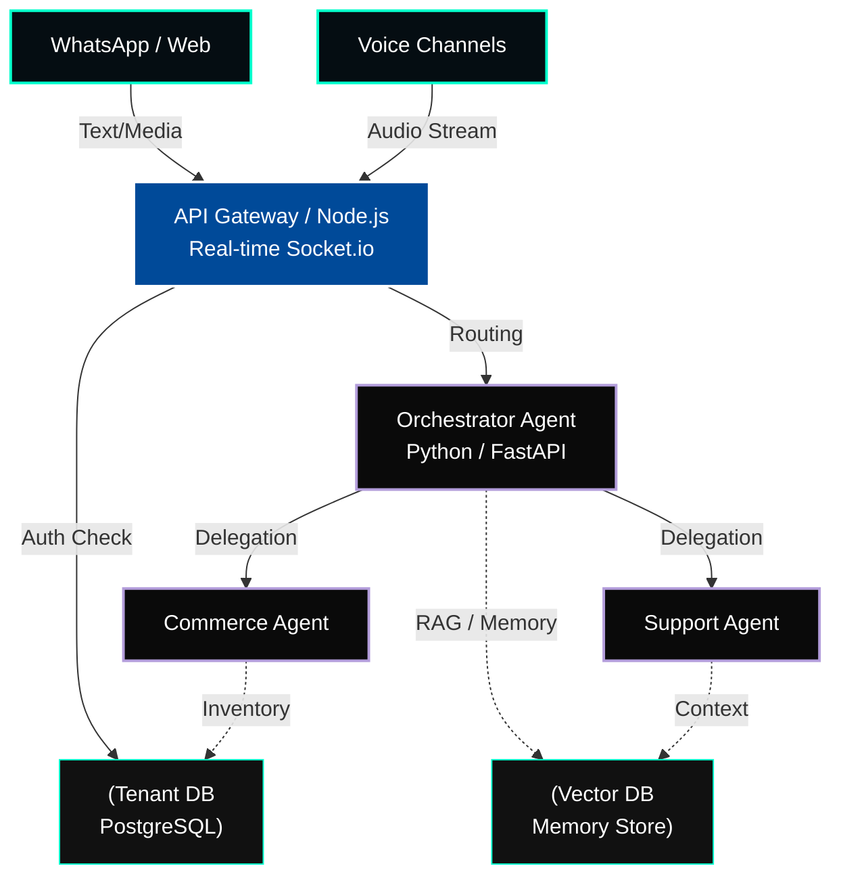

  

  
  

# 🚀 Future AGI: The Agentic Engineering Hub

🛡️ **Agentic Engineering Standard** | 📞 **Voice AI** | 💬 **WhatsApp E-commerce** | ⚡ **29k Req/Sec**

Future AGI is an integrated platform built for the **Evolution of Software**. We move beyond simple "Vibe Coding" into the professional realm of **Agentic Engineering**—building reliable, self-improving systems that operate like an actual company.

---

## 📐 System Architecture Demo

Our system employs a polyglot microservices approach, leveraging Python (Intelligence), Node.js (Real-time), and C (High-Perf Core) to handle complex agentic orchestration.

### 🧠 Agentic Flow Demonstration
1. **Intake:** The API Gateway receives an inbound WhatsApp message.
2. **Contextualization:** The Orchestrator Agent searches the Vector DB for conversational history.
3. **Delegation:** Depending on the intent (e.g., "Where is my order?"), it delegates to the Commerce Agent.
4. **Execution:** The Commerce Agent checks the Tenant DB and formulates a response, returning it via the Real-time Node.js server.

---

## 🧬 The 3 Stages of Software Evolution

| Stage | Name | Description | Status |
|---|---|---|---|
| 1️⃣ | **Vibe Coding** | Just talking and making things. Magic for prototypes, but breaks at scale. | 🗄️ Legacy |
| 2️⃣ | **Flow Engineering** | Using graphical data paths. Better, but gets messy quickly. | 🔄 Intermediate |
| 3️⃣ | **Agentic Engineering** | Building Teams of Agents with specific Jobs, Memory, and Tools. | 🚀 **Future AGI Standard** |

---

## 🏗️ Elite Multi-Service Architecture

Built with the modern **Full Stack Developer Roadmap** in mind, utilizing a polyglot stack for maximum performance:
*   **SaaS Core:** PHP (Laravel 11) — Tenant & Billing Logic.
*   **Real-time AI:** Node.js (Socket.io) — WhatsApp & AI Stream Processing.
*   **Intelligence:** Python (FastAPI) — Self-Improvement Loops & Agents.
*   **High-Perf:** C (libuv) — Low-level event orchestration.

---

## 🗺️ The Path to Mastery
We don't just provide code; we provide a roadmap for the modern developer.
[**→ View the Full Stack & Agentic Roadmap**](./ROADMAP.md)

---

## ✨ Core Capabilities
- **🏢 Enterprise AI:** Delegate to M365 Copilot via A2A.
- **📞 AI Voice:** Integrated call flow management.
- **💬 WhatsApp Commerce:** In-chat orders and invoicing.
- **🤝 LinkedIn Outreach:** Automated prospecting.
- **🛡️ 18-Layer Security:** Hardened protection for agent interactions.

---

## 📄 License & Copyright
© 2026 **Kirov Dynamics Technology** | **Koketso Raphasha**
Licensed under the **Apache License 2.0**. No billing noise, no hidden tiers—100% professional engineering.
