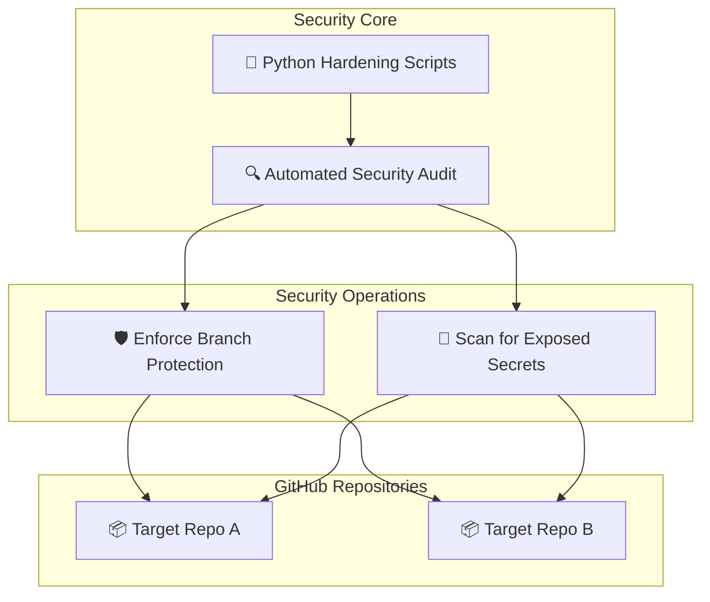

# 🛡️ GitHub Harden
### Advanced Repository Security & Automated Audit Framework

---

🔗 **Purpose**
This repository serves as a powerful, centralized hub to audit, protect, and harden the security of all your GitHub repositories. It utilizes the power of Python to automate security enhancements and ensure compliance.

📌 **Core Features**
- **Branch Protection** — Automated enforcement of `main` branch protection rules.
- **Billing Noise Reduction** — Streamlined CI/CD with zero unnecessary action runs.
- **Automated Security Shield** — Python-powered tools to scan, audit, and patch vulnerabilities.
- **TLS & Secret Verification** — Continuous monitoring for exposed secrets and insecure protocols.

✨ **Developed By: Raphasha27**

---

🛡️ **Security & Protection Strategy**
- **Protected Main Branch** — Direct commits are restricted; all changes must pass rigorous security checks.
- **POPIA/GDPR Compliant Audits** — Zero-persistence policy for sensitive data.
- **SHA-256 Hashing** — Tamper-proof fingerprint on configurations.
- **L5 Sentinel Encryption** — Transport-layer encryption for all API interactions.

🏗️ **Monorepo Structure**
- `apps/landing` — Main Next.js public-facing app.
- `services/core` — FastAPI backend (Python 3.11).
- `scripts/` — Security audit and data pipeline tools.

---

🗺️ **Hardening Architecture**



🚀 **Quick Start**
To run the local security audit tool using the power of Python:
```bash
python scripts/local_security_audit.py --mode transport-layer-check
```

---

## 📈 Contribution Graph


---

📜 **License**
MIT © 2026 — **Raphasha27**

---
🛡️ *GitHub Harden — Securing repositories with Python and advanced auditing.*
