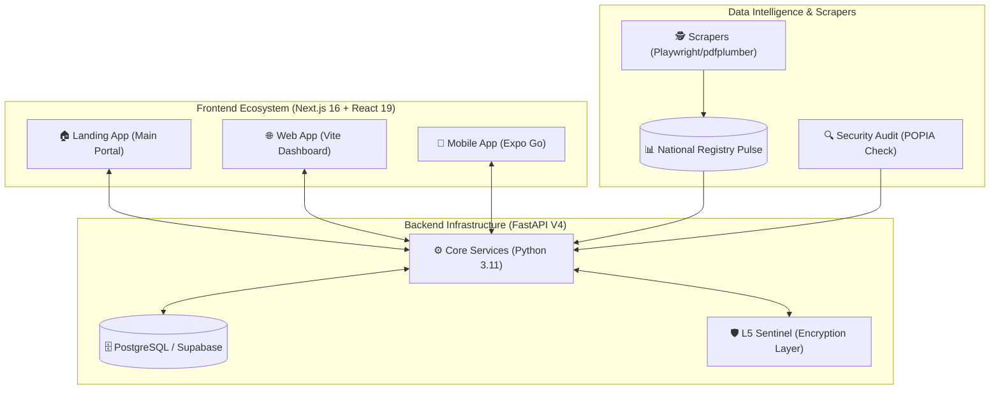
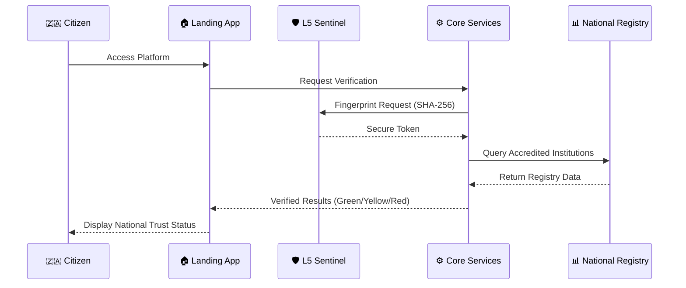

# 🇿🇦 SUMBANDILA
### National Youth Growth Ecosystem — Republic of South Africa
**"Sumbandila" (Venda) — "The one who leads the way."**

---

🔗 **Official Demo**
Live Platform: [https://landing-five-orcin-61.vercel.app](https://landing-five-orcin-61.vercel.app)

📌 **What Is Sumbandila?**
Sumbandila is an official national digital infrastructure platform built to connect South African citizens — especially youth — to verified opportunities, government services, skills training, and institutional accreditation.

✨ **Developed By: Kirov Dynamics Technology**

---

🛡️ **Security & Compliance**
- **POPIA Compliant** — Zero-persistence policy for sensitive personal data.
- **SHA-256 Hashing** — Tamper-proof fingerprint on every verified credential.
- **L5 Sentinel Encryption** — Transport-layer encryption across all API calls.
- **Automated Security Shield** — Powered by Kirov Dynamics proprietary audit logic.

🏗️ **Monorepo Structure**
- `apps/landing` — Main Next.js public-facing app.
- `services/core` — FastAPI backend (Python 3.11).
- `scripts/` — Security audit and data pipeline tools.

---

🗺️ **Platform Architecture**



🔄 **User Journey Flow**



🚀 **Quick Start**
```bash
npm install
npm run dev
```

---

## 📈 Contribution Graph


---

📜 **License**
MIT © 2026 — **Kirov Dynamics Technology** · Republic of South Africa

---
🇿🇦 *Sumbandila — Fighting Corruption through Digital Integrity. Built on Ubuntu. Powered by Batho Pele.*
