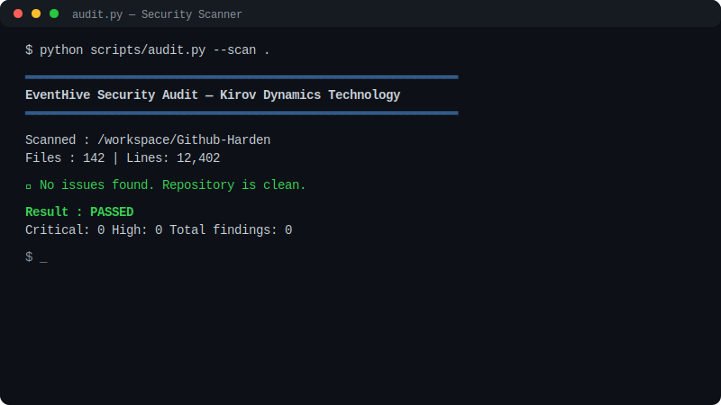
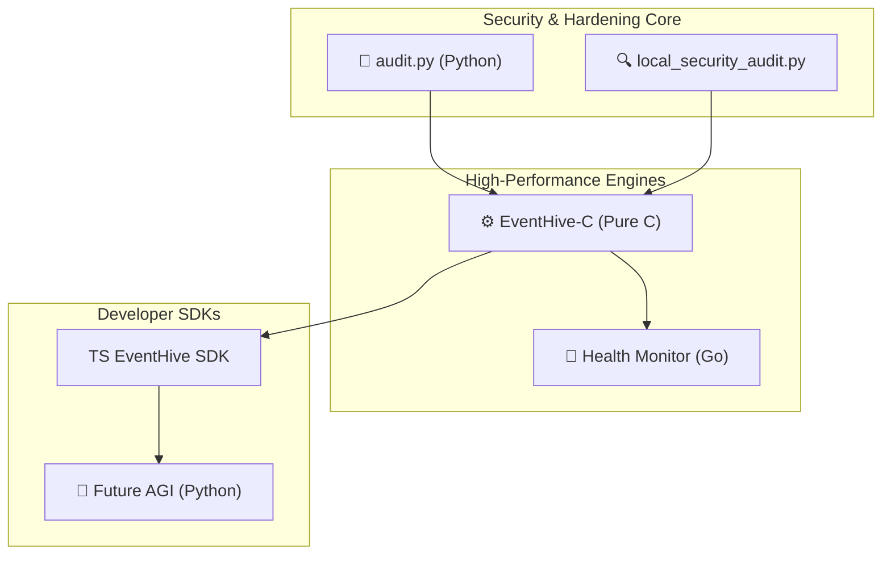

# 🛡️ GitHub Harden
### Advanced Multi-Language Security Framework & Repository Hardening

---

## 🔗 Purpose & Vision
This repository is the central hub for repository security hardening, bug resolution, and machine learning logic training. Operated by **Kirov Dynamics Technology**, it serves as a production-grade framework for:
- **Testing & Stabilizing** complex projects with zero billing noise.
- **Automated Auditing** across multiple programming languages (C, Python, Go, TypeScript).
- **Machine Logic Training** — established patterns for vulnerability scanning and error resolution.

Once fully validated, this ecosystem will be deployed as an open-source educational demo to assist developers in building secure, high-performance systems.

---

## 🤝 Agency Partner Program
**I build. You scale.**  
I partner with agency owners, marketers, and funnel builders to handle the complex build side of AI Voice Agents.
- **Lead Qualification & Routing**
- **Automated Appointment Booking**
- **Advanced CRM & Workflow Sync (15+ Connectors)**
- **n8n Workflow Engineering (Real Problem Solving)**
- **Elite AI Tactics (SOPs, PDF Action Plans, Intel)**
- **Backend White-Label Support**

[**Become a Partner**](https://github.com/Raphasha27/Github-Harden/blob/main/apps/landing/pages/partner.jsx)

---

## 🚀 Multi-Language Ecosystem
The project showcases architectural "power" across several high-performance stacks:

| Component | Language | Tech Stack | Purpose |
|---|---|---|---|
| **EventHive-C** | C | `libuv`, `http-parser`, `SQLite3` | High-precision event orchestration engine. |
| **Security Engine** | Python | `argparse`, `regex`, `json` | Comprehensive local security & PII auditor. |
| **Health Monitor** | Go | `net/http`, `encoding/json` | Dependency-free real-time engine health checker. |
| **Future AGI** | Python | `LangChain`, `CrewAI`, `FastAPI` | Integrated platform for AI self-improvement. |
| **Landing App** | Next.js | `React`, `Tailwind CSS` | Public-facing interface for the ecosystem. |

---

## 📊 Live Demonstrations

### 🎬 Security Audit Demo (`audit.py`)

*Figure 1: Automated security scanning detecting leaked secrets and private IPs.*

### 🎪 Event Command Center (`EventHive-C`)
**[View Live Dashboard](https://raphasha27.github.io/SupportHive-C)** — Deployed for free via GitHub Pages.

---

## 🏗️ Architecture & Logic Flow



---

## 🛠️ Integrated Tooling

### 1. Python Security Auditor
Comprehensive scan for secrets, private IPs, and POPIA/GDPR violations:
```bash
python scripts/audit.py --scan .
```

### 2. Go Health Monitor
Real-time health checking of the EventHive engine:
```bash
go run scripts/monitor.go --host localhost --port 7000 --tenant gala-2026
```

### 3. TypeScript SDK
Integration-ready SDK for modern web applications:
```typescript
import { EventHiveClient } from './scripts/eventhive-sdk';
const client = new EventHiveClient({ tenantId: 'gala-2026' });
```

---

## 🔒 Security & Privacy Strategy
- **Zero Billing Noise**: All CI/CD workflows are optimized or run locally to prevent cloud costs.
- **IP Protection**: Automatic detection and removal of local network addresses.
- **Protected Main Branch**: Single source of truth with strict merge policies.

---

## 📈 Contribution Graph


---

📜 **License**
MIT © 2026 — **Raphasha27** & **Kirov Dynamics Technology**

🛡️ *GitHub Harden — Securing the future of repository management through multi-language excellence.*
