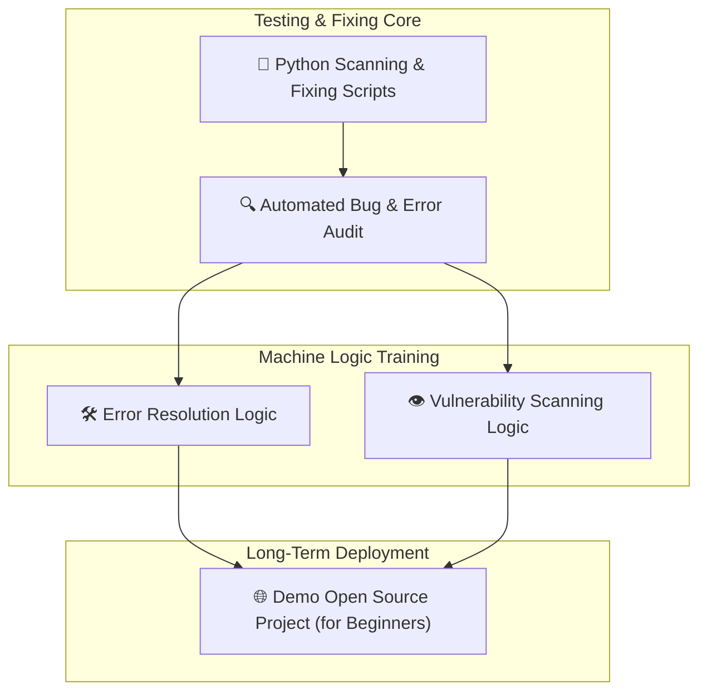

# 🛡️ GitHub Harden
### Advanced Repository Security & Automated Audit Framework

---

🔗 **Purpose**
The primary purpose of this repository is to test projects, fix bugs, and resolve errors using the right tools to avoid billing noise. It empowers users to make impactful and useful changes through appropriate command inputs over the long term. 

Once this product is fully tested by **Kirov Dynamics Technology**, it will be deployed as a demo open-source project designed to assist beginners in understanding security, bug fixing, and repository management.

🤖 **AI Training & Machine Logic**
A core focus of this repository is to train machine logic and AI agents using the established patterns of fixing, scanning, and auditing code. By documenting these processes, we create a powerful learning environment for both humans and machines.

📌 **Core Principles**
- **Eliminate Billing Noise** — Strategic use of local tools and optimized workflows to prevent unnecessary CI/CD costs.
- **Impactful Changes** — Focused on meaningful security enhancements and bug fixes driven by user commands.
- **Continuous Testing** — A safe sandbox to test projects and validate security fixes.

✨ **Developed By: Raphasha27** & **Kirov Dynamics Technology**

---

🛡️ **Security & Protection Strategy**
- **Protected Main Branch** — The `main` branch is strictly protected to ensure stability and security.
- **Automated Security Shield** — Python-powered tools to scan and audit vulnerabilities.
- **POPIA/GDPR Compliant Audits** — Zero-persistence policy for sensitive data during scans.

🏗️ **Monorepo Structure**
- `apps/landing` — Main Next.js public-facing app.
- `services/core` — FastAPI backend (Python 3.11).
- `scripts/` — Python-based security audit and scanning tools.

---

🗺️ **Hardening & Training Architecture**



🚀 **Quick Start**
To run the local security audit tool using the power of Python:
```bash
python scripts/local_security_audit.py --mode transport-layer-check
```

---

## 📈 Contribution Graph


---

📜 **License**
MIT © 2026 — **Raphasha27**

---
🛡️ *GitHub Harden — Securing repositories with Python and advanced auditing.*
