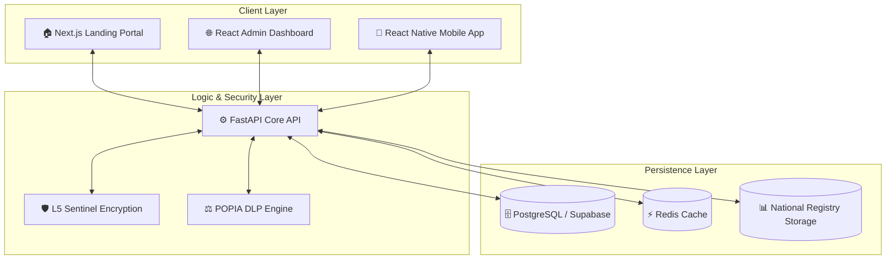
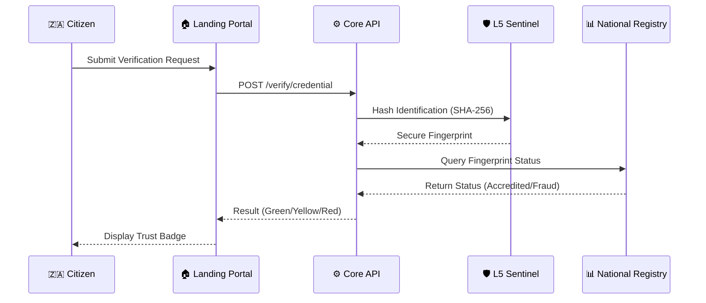
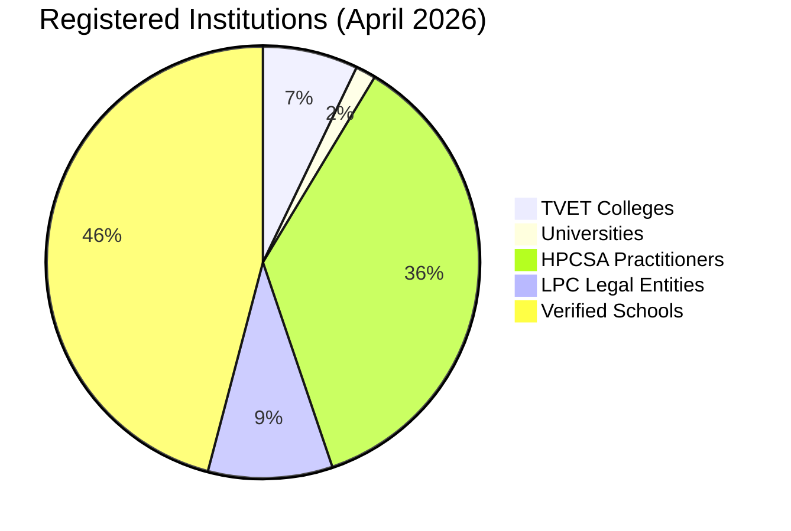

# 🏛️ Technical Blueprint: Sumbandila National Ecosystem
### Governance by Kirov Dynamics Technology

---

## 🗺️ System Architecture

---

## 🔄 National Verification Flow

---

## 🛡️ Security Posture (L5 Sentinel)
The Sumbandila platform implements the **L5 Sentinel** protocol, ensuring that no sensitive PII is ever stored in plain text.
- **Transport Layer**: Enforced TLS 1.3 for all inter-service communication.
- **Data at Rest**: AES-256 encryption for all registry records.
- **Anonymization**: Citizens are tracked via SHA-256 fingerprints, preserving privacy while enabling national-scale verification.

---

## 📈 Platform Growth Pulse
Real-time monitoring of the national registry expansion.

---
© 2026 Kirov Dynamics Technology · All Rights Reserved.
